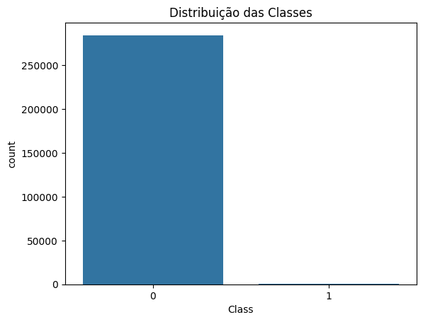
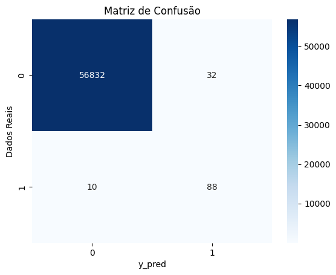

# Detector de Fraude AI
Modelo preditivo detecta fraude de cartão de crédito.

## Índice
1. [Descrição](#descrição)
2. [Interface Interativa](#interface-interativa)
4. [Treinamento](#treinamento)
5. [Avaliação](#avaliação)
6. [Contribuição](#contribuição)
7. [Referências](#referências)
8. [Licença](#licença)

## Descrição

Modelo com características de aprendizado supervisionado que detecta fraude de cartão de crédito com base no conjunto de dados de treinamento.

## Interface Interativa

Para visualizar a Interface Interativa e testar acesse:[App Streamlit](https://detectordefraudeai.streamlit.app/)

## Treinamento

Os dados foram preprocessados dentro de uma pipeline do imblearn, e foram tratados com [SMOTE](https://imbalanced-learn.org/stable/references/generated/imblearn.over_sampling.SMOTE.html) devido ao conjunto de dados ser extremamente desbalanceado, e também [MinMaxScaler](https://scikit-learn.org/stable/modules/generated/sklearn.preprocessing.MinMaxScaler.html).

## Avaliação

### Matriz de confusão

### Validação Cruzada

A validação foi feita manualmente para a aplicação do SMOTE não afetar a validação, assim, não comprometendo os resultados.

## Contribuição

1. Faça um fork do projeto
2. Crie uma branch com sua feature (`git checkout -b feature/nome-da-feature`)
3. Adicione as mudanças no git local (`git add .`)
4. Comite suas mudanças (`git commit -m 'Nome da Alteração'`)
5. Faça o push para a branch (`git push origin feature/nome-da-feature`)
6. Abra um Pull Request e descreva as alterações

## Referências

Esse trabalho só foi possibilitado pelos estudos a seguir:

Andrea Dal Pozzolo, Olivier Caelen, Reid A. Johnson e Gianluca Bontempi. Calibrando Probabilidade com Subamostragem para Classificação Desequilibrada. No Simpósio sobre Inteligência Computacional e Mineração de Dados (CIDM), IEEE, 2015

Dal Pozzolo, Andrea; Caelen, Olivier; Le Borgne, Yann-Ael; Waterschoot, Serge; BONTEMPI, Gianluca. Lições aprendidas na detecção de fraudes de cartão de crédito do ponto de vista do profissional , Sistemas especialistas com aplicativos, 41,10,4915-4928,2014, Pergamon

Dal Pozzolo, Andrea; Boracchi, Giacomo; Caelen, Olivier; Alipi, César; BONTEMPI, Gianluca. Detecção de fraude de cartão de crédito: uma modelagem realista e uma nova estratégia de aprendizagem, transações IEEE em redes neurais e sistemas de aprendizagem,29,8,3784-3797,2018,IEEE

Dal Pozzolo, Andrea Aprendizado de máquina adaptativo para detecção de fraude de cartão de crédito Tese de doutorado da ULB MLG (supervisionado por G. Bontempi)

Carcillo, Fabrice; Dal Pozzolo, Andrea; Le Borgne, Yann-Aël; Caelen, Olivier; Mazzer, Yannis; BONTEMPI, Gianluca. Scarff: uma estrutura escalável para streaming de detecção de fraude de cartão de crédito com Spark , Information fusion,41, 182-194,2018,Elsevier

Carcillo, Fabrice; Le Borgne, Yann-Aël; Caelen, Olivier; BONTEMPI, Gianluca. Streaming de estratégias de aprendizagem ativa para detecção de fraude de cartão de crédito na vida real: avaliação e visualização, International Journal of Data Science and Analytics, 5,4.285-300.2018,Springer International Publishing

Bertrand Lebichot, Yann-Aël Le Borgne, Liyun He, Frederic Oblé, Gianluca Bontempi Técnicas de adaptação de domínio de aprendizagem profunda para detecção de fraude de cartões de crédito , INNSBDDL 2019: avanços recentes em Big Data e aprendizagem profunda, pp 78-88, 2019

Fabrizio Carcillo, Yann-Aël Le Borgne, Olivier Caelen, Frederic Oblé, Gianluca Bontempi Combinando aprendizagem não supervisionada e supervisionada em ciências da informação de detecção de fraude de cartão de crédito, 2019

Yann-Aël Le Borgne, Gianluca Bontempi Aprendizado de máquina reproduzível para detecção de fraude de cartão de crédito - Manual prático

Bertrand Lebichot, Gianmarco Paldino, Wissam Siblini, Liyun He, Frederic Oblé, Gianluca Bontempi Estratégias de aprendizagem incremental para detecção de fraude em cartões de crédito , IInternational Journal of Data Science and Analytics

## Licença

Este projeto está licenciado sob a [MIT License](./LICENSE)
